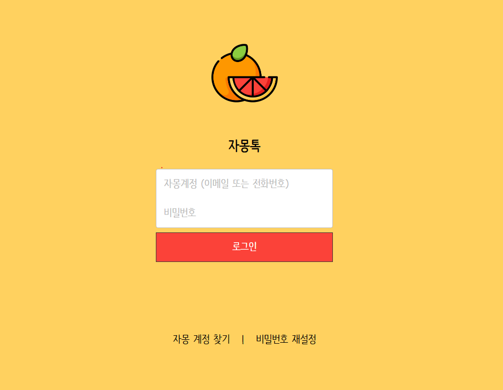

## 강의명 : 초보자를 위한 Sass 기초 강의 & 자몽톡 클론코딩

### Demo: https://sass-zamong-talk.netlify.app/

    

---

- 이후 해보기
  1. 친구 목록 만들기
  2. 레이아웃 변경하기 - 카\*카오톡 모바일 앱 레이아웃, 윈도우 버전 앱 레이아웃 등
  3. 내 말풍선 추가하기 (현재는 상대방의 말풍선만 만들어져 있어요)
  4. (자바스크립트 사용이 가능하다면)메시지 입력하면 말풍선이 추가되는 기능 추가하기
  5. 기타 등등. 도전해 볼 만한 과제는 얼마든지 많으니 자몽톡 코드를 다양한 방법으로 가지고 놀아보세요!!

 

- Sass 참고 자료
  - [sass-lang.com](https://sass-lang.com/) - 공식 홈페이지. 기본 예제와 Documentation 제공
  - [sass-guidelin.es/ko](https://sass-guidelin.es/ko/) - Sass 사용자가 참고할 만한 스타일 가이드 제공
  - [sassmeister.com](https://www.sassmeister.com/) - 컴파일 기능을 포함한 Sass 전용 온라인 에디터
